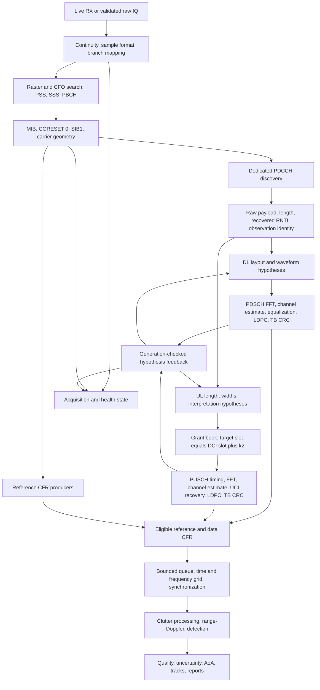
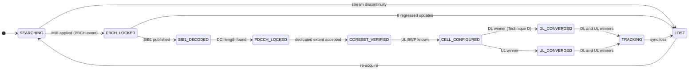

# Fully Passive and Agnostic NR Receiver — Architecture, Algorithms, and Open Work

**Source audit: 2026-09-12, sens6, `/home/sens/NICOLA/adaptive-rx-UL-DL`.**
Base HEAD: `d2513756bce934c591a453b57a9f3aad529b5b13`, with existing uncommitted
receiver changes and an untracked autonomous-acquisition launcher. This document
describes the inspected working tree, not a claim that its changes are all in that
commit or in the running binary. Source paths below are relative to this checkout.

**Objective:** an independent, adaptive, receive-only observer that derives its NR
configuration and synchronization from received signals and produces defensible
DL/UL channel measurements for passive sensing. **Current status: incomplete.**
Broadcast acquisition, bounded dedicated-configuration inference, DL/UL decoding,
and a substantial sensing stack exist. Universal NR configuration discovery,
complete recovery, and general multi-illuminator sensing are not established.

The reference experiment uses an X410, n78 near 3450 MHz, 273 PRBs, 30 kHz SCS,
and PCI 2. These are experiment provenance, never permissible runtime cell hints
for an agnostic result. No new modem, radio experiment, or native regression suite
was run for this documentation update. Historical results and current source
observations are separated in §17.

## Contents

1. [Objective, scope, and passivity](#1-objective-scope-and-passivity)
2. [Signal model and observability](#2-signal-model-and-observability)
3. [End-to-end pipelines](#3-end-to-end-pipelines)
4. [Observation, timing, and configuration contracts](#4-observation-timing-and-configuration-contracts)
5. [RF input, acquisition, and broadcast geometry](#5-rf-input-acquisition-and-broadcast-geometry)
6. [Acquisition state and recovery](#6-acquisition-state-and-recovery)
7. [Blind control-channel discovery](#7-blind-control-channel-discovery)
8. [Hypothesis search and confidence](#8-hypothesis-search-and-confidence)
9. [Downlink interpretation and decoding](#9-downlink-interpretation-and-decoding)
10. [Uplink interpretation and decoding](#10-uplink-interpretation-and-decoding)
11. [Waveform diagnostics and unknown identities](#11-waveform-diagnostics-and-unknown-identities)
12. [CFR production and asynchronous execution](#12-cfr-production-and-asynchronous-execution)
13. [Sensing synchronization and CPI formation](#13-sensing-synchronization-and-cpi-formation)
14. [Range-Doppler processing and detection](#14-range-doppler-processing-and-detection)
15. [Detection quality, uncertainty, AoA, and tracking](#15-detection-quality-uncertainty-aoa-and-tracking)
16. [Parameter provenance and capability ledger](#16-parameter-provenance-and-capability-ledger)
17. [Evidence and paper evaluation protocol](#17-evidence-and-paper-evaluation-protocol)
18. [Missing work and falsifiable acceptance gates](#18-missing-work-and-falsifiable-acceptance-gates)
19. [Implementation map and references](#19-implementation-map-and-references)

## 1. Objective, scope, and passivity

### 1.1 What the receiver does

The node observes an existing NR cell and the cell's independently operating UEs.
It recovers broadcasts, control-channel codewords and scheduling hypotheses,
attempts PDSCH/PUSCH transport-block decoding, and extracts channel frequency
responses (CFRs) from reference signals and reconstructed data. It neither joins
the cell nor asks the scheduler for useful sensing transmissions.

Decoding a physical transport block can recover ciphered higher-layer bits. It
does not imply decrypting protected RRC or application traffic. PHY reconstruction
can use those bits without knowing their plaintext meaning.

### 1.2 Non-negotiable runtime contract

- No SIM-based attachment, RRC connection, PRACH, scheduling request, ACK/NACK,
  sounding transmission, or other intentional over-the-air transmission by this node.
- No gNB configuration files, logs, scheduler hints, coordination messages, active-UE
  configuration, or externally supplied frame/slot timing enter runtime inference.
- The receiver and observed UEs remain independent; traffic and scheduling adapt
  normally. The receiver adapts to observations rather than prescribing traffic.
- Device addresses, antenna geometry, calibrated sample format, RF capability,
  compute budget, and a search interval are receiver knowledge. A known cell's PCI,
  RNTI, dedicated BWP, scrambling identities, CFO, or TDRA is not.
- Manual configurations and saved interpreted jobs are permitted as labeled
  offline oracles. Their results cannot be reported as autonomous cold acquisition.
- Ground truth is read only by an external evaluator after inference. It must
  not steer runtime search, synchronization, selection, thresholds, or retries.

**Implementation boundary.** In [nr-ue.c](executables/nr-ue.c), `RU_write()` returns
before the radio write in passive mode on real hardware. MAC passive behavior
retains broadcast reception without normal attachment. The RF simulator retains
dummy writes because its sample clock depends on them; this is a simulator
mechanism, not an OTA transmission. The UHD backend still contains TX setup and
streamer creation code. Software write suppression is the inspected mechanism;
complete driver-path and physical emission verification remain acceptance work.

### 1.3 What “agnostic” can defensibly mean

For every parameter, record its domain, provenance, evidence, validity interval,
and unresolved alternatives. Distinguish:

| Status | Meaning |
|---|---|
| Broadcast-derived | Decoded and checked within a particular cell/timing generation; not infallible or permanent. |
| Signal-estimated | Estimated from IQ/CFR with stated assumptions, uncertainty, and failure tests. |
| CRC-supported | A hypothesis or equivalence class has decoded real blocks within a declared search domain. |
| Assumed | A default or provisional interpretation is used; it is not learned merely because the run started. |
| Unsupported / unsearched | The implementation cannot evaluate some legal configurations. |
| Unresolved / ambiguous | Insufficient evidence or multiple surviving explanations. |

A CRC winner is not proof of every dedicated configuration field. Distinct layouts
can generate the same allocation for observed payloads. Unused TDRA entries and
silent resources are unobservable until traffic exercises them. No finite receiver
can infer arbitrary unsignaled, unused configuration from absent observations.

The earlier “29 of 35 parameters, 83% agnostic” statement is withdrawn as a coverage
metric: its bins mixed measurements, broadcasts, assumptions, and diagnostics and
its denominator omitted legal configuration domains. Report a capability matrix
and acquisition/decoding/sensing performance separately.

## 2. Signal model and observability

### 2.1 Received signal

A useful explanatory model for receive branch `a` is

```text
y_a(t) = Σ_u exp(j[2π Δf_u t + φ_u(t)])
              Σ_p α_(a,u,p)(t) x_u((1+ε_u)t − τ_(u,p)) + w_a(t).
```

`u` indexes illuminators: the gNB in DL and individual UEs in UL. `p` indexes
propagation paths; `Δf_u` is relative oscillator frequency offset, `ε_u` relative
sampling-rate error, and `φ_u` residual phase noise. The receiver does not know
all transmitted `x_u` initially. It reconstructs known reference symbols first,
then eligible data symbols after successful decoding.

For one resolved layer after OFDM processing,

```text
Y_a[k,m] = H_a[k,m] X[k,m] + W_a[k,m]
Ĥ_a[k,m] = Y_a[k,m] conj(X[k,m]) / |X[k,m]|².
```

An effective channel includes transmit precoding and receiver impairments not yet
removed. A beam/precoder change can therefore break phase coherence even when all
TBs decode. With multiple layers, `Y_a = Σ_l H_(a,l)X_l + W_a`; scalar `Y/X` is
invalid. The current data-aided CFR path explicitly guards against this case.

### 2.2 Delay, timing, Doppler, and geometry are different quantities

| Quantity | Meaning and units |
|---|---|
| Sample timestamp | Receiver acquisition coordinate, in samples; identifies the data actually processed. |
| SFN/slot/symbol | NR timing identity derived from synchronization, with SFN wrap and a configuration generation. |
| STO | Frame/FFT-window displacement in samples or seconds; not target range. |
| CFO | Relative carrier offset in Hz; not automatically target Doppler. |
| SFO | Relative sampling-clock drift, dimensionless or ppm; not obtained by dividing CFO by RF frequency without a justified hardware model. |
| Propagation delay | Path delay relative to a documented reference after synchronization corrections. |
| Doppler | Path phase evolution relative to a documented illuminator/reference. |

For a fixed transmitter `t`, receiver `r`, and target at `p`, the intended
direct-path-referenced bistatic measurement is

```text
ρ(p) = ||p−t|| + ||p−r|| − ||t−r|| = c τ_excess
ρ_dot = (unit(p−t) + unit(p−r)) · v_target
|ρ_dot| = λ |f_D|, with sign fixed by the transform convention.
```

The engine uses a bistatic range/range-rate scale, **without a monostatic factor
of one half**. Output labels such as `vel_mps` refer to bistatic range rate, not
target speed. Absolute position needs geometry and usually bearing or multiple
independent bistatic measurements. A movable UL illuminator requires its own
geometry and direct-path derivative; the fixed-transmitter expression above is
then insufficient. Unknown transmitter position does not prevent delay-Doppler
measurement, but prevents claiming absolute localization from it alone.

## 3. End-to-end pipelines



This is a logical dependency graph. Not every edge is gated by a unified validated
configuration object today. In particular, reference CFR can be produced before
TB success, and the acquisition tracker aggregates partially latched evidence.

The autonomous launcher adds a separate outer loop:

```text
scan RF windows → probe broadcasts → derive actual geometry → stop probe cleanly
→ reopen at derived geometry → reacquire fresh timing/CFO → revalidate → ACQUIRED.
```

It currently sets `ISAC_SYNC_ONLY=1`: acquisition and synchronization continue,
while target detection is disabled. Launcher `ACQUIRED`, native `TRACKING`, and
successful sensing are three different outcomes.

## 4. Observation, timing, and configuration contracts

### 4.1 Required observation identity

An auditable grant should carry at least

```text
capture/session ID, sample epoch, cell key, configuration generation,
unwrapped absolute slot, symbol interval, IQ sample interval,
CORESET/search-space hypothesis, CCE start, aggregation level,
raw DCI length and payload, recovered RNTI,
layout/configuration hypothesis ID and search ticket,
target BWP and allocation, decoder result and rejection reason.
```

This is the target contract, not a claim that one current structure contains all
fields. Existing raw DCI records, keyed search tickets, UL grant-book entries,
sample-lifetime checks, and counters implement parts of it. A PCI alone is not a
globally unique cell identifier; an RNTI alone is not a permanent UE identity.

### 4.2 Outcome taxonomy

Keep these counters and outcomes separate:

1. Raw control decode / CRC-mask candidate.
2. Protocol-plausible interpretation, including ambiguous alternatives.
3. Supported decoder job submitted, queued, and executed.
4. Actual completed TB CRC pass or fail.
5. Rejected protocol interpretation, unsupported waveform, allocation/setup error,
   queue-full drop, expired IQ, stale generation, or duplicate observation.
6. Reference CFR accepted and data-aided CFR accepted.

Items in category 5 are not failed TB decodes. Repeated reconstruction, alternate
UCI trials, overlapping CCE candidates, and replay retries are not independent
over-the-air TB observations. A unified deduplication contract is still missing.

### 4.3 Generation and evidence lifetime

DL contexts are keyed by configuration, RNTI, observed TDA index, and type-A DM-RS
position; tickets identify the context generation and selected hypothesis. UL
contexts also isolate RNTI and DCI length. Relearning or incompatible geometry
must invalidate old asynchronous feedback. Context eviction discards evidence;
it must never transfer one UE's score to another.

Generation checks already exist in the search controllers. A universal epoch
covering IQ continuity, synchronization, broadcast configuration, RNTI reuse,
decoder jobs, CFR rows, and tracking state does not yet exist. That is an upstream
correctness gap, not a problem to solve by adjusting sensing thresholds.

## 5. RF input, acquisition, and broadcast geometry

### 5.1 Live and file inputs

The reference live setup supplies complex baseband at 122.88 MSamples/s. Four
unshifted `sc16` streams imply about 1.966 GB/s of payload; one stream is about
491.52 MB/s. This is calculated throughput, not measured disk capability.

The file-only backend validates channel/sample geometry, timestamps, bounds, and
EOF and allows replay through native acquisition. Raw recorder samples and the
production PHY input have a specific scaling contract: the documented X400 path
requires a signed arithmetic right shift of two bits, including correct handling
of negative values. This is sample-format conversion, not a gain optimization.

Long replay mappings must not inherit `MCL_FUTURE` memory locking: a recorded
59 GB file otherwise forces more locked memory than the host can supply. The
file-backend fix is documented separately from live-radio memory policy.

There are **two distinct replay facilities**:

| Facility | Inputs | Valid use |
|---|---|---|
| Raw replay | IQ, capture timing/format/geometry; fresh acquisition | Broadcast acquisition, continuity, learning, and recovery tests. |
| `nr_passive_replay_capture.c` / `replay.bin` | Same-build ABI metadata, saved frame parameters/CFO, DCI examples, interpreted jobs, reference TB hashes | Bit-identical decoder/oracle regression; not autonomous acquisition. |

Recorder backlog, timestamp loss, sample-format mismatch, truncation, or incompatible
ABI makes the affected experiment VOID. Real-time replay is a pacing policy, not
proof that CPU scheduling or convergence outcomes are deterministic.

### 5.2 In-window SSB and CFO acquisition

The native path searches candidate GSCNs within the digitized RF window, performs
PSS correlation and SSS detection, and requires PBCH decoding to establish a cell
and frame interpretation. PSS/SSS jointly identify PCI; PCI is not a MIB field.
The new autonomous-acquisition changes add coarse CFO hypotheses evaluated on
independent IQ copies, followed by refinement and PBCH CRC. Exact tested coverage
must be tied to the binary revision, because these changes are in the working tree.

PBCH/MIB supplies or enables recovery of SFN-related timing, common SCS, SSB
subcarrier offset, DM-RS type-A position, and `pdcch-ConfigSIB1`. CORESET#0 and
search-space-0 construction enable SI-RNTI control and SIB1 PDSCH reception.

SIB1 publishes initial DL/UL BWP/common configuration, common TDRA lists, relevant
UL scheduling offsets, TDD configuration, and frequency geometry. A common TDRA
list is not proof that every dedicated grant uses that list. Encrypted dedicated
RRC remains unknown. Control monitoring and broadcast procedures are anchored to
[TS 38.213](https://www.etsi.org/deliver/etsi_ts/138200_138299/138213/18.02.00_60/ts_138213v180200p.pdf).

### 5.3 Recovering carrier geometry

The implemented FR1 geometry calculation uses

```text
Δf = 15000 · 2^μ Hz
f_SSB_low = f_SS_ref − 120 Δf
f_PointA = f_SSB_low − (12 offsetToPointA + k_SSB) · 15000 Hz
f_center = f_PointA + (offsetToCarrier + N_RB/2) · 12 Δf.
```

`offsetToPointA` and `k_SSB` here use the FR1 15 kHz reference units; applying the
trial numerology to those offsets creates a wrong frequency origin. The native
carrier verifier checks bandwidth, numerology, and placement against the started
grid and reports a derived center on mismatch. The launcher additionally rejects
unsupported noninteger grid alignment. A startup parameter becomes corroborated
only after its independent broadcast/geometry check succeeds.

### 5.4 Autonomous band/window launcher: implemented source, validation open

[auto_acquire.py](tests/passive_rx/auto_acquire.py) builds bounded RF windows from
the repository's FR1 raster/bandwidth tables and a user-selected capability/search
domain. It probes, extracts SSB/SIB1 evidence, can recenter an edge SSB once when
SIB1 is missing, derives the carrier, stops the probe, reopens the device, and
revalidates broadcasts using fresh timing/CFO before `ACQUIRED`.

Its current accepted domain is terrestrial FR1, same 15/30 kHz SSB/DL/UL
numerology, co-channel TDD, equal DL/UL grid widths, shared Point A, zero
`offsetToCarrier`, and an integer-aligned SSB. It refuses FDD, FR2/NTN, mixed
numerologies, asymmetric grids, and unsupported geometry. The launcher requires
four receive branches in its present host integration.

It writes `acquisition.json`, per-attempt logs, `candidate.json`, and independently
revalidated `acquired.json`. A finite probe without SIB1 is `INCONCLUSIVE`, not
proof that the window contains no cell. Device/stream faults are VOID. The
[launcher documentation](tests/passive_rx/AUTONOMOUS_ACQUISITION.md) explicitly
reports that its new code was not built or OTA-tested in that implementation task.
Thus the old report's “band walk not built” is stale, but “validated autonomous
band acquisition” would also be unsupported.

### 5.5 Online tracking and CFO validity

Timing and digital frequency loops maintain reception using received evidence.
The autonomous path seeds sampling drift at zero and learns it online; it does
not use a remembered deployment CFO or infer SFO from CFO. Stop/reopen retuning
between acquisition attempts is distinct from an in-stream LO adjustment.

A nonzero CFO estimate alone does **not** prove mis-lock. A saved valid replay in
§17 acquired broadcasts near −15 kHz CFO. Distinguish initial oscillator offset,
applied correction, and residual error; validate consistency using broadcasts,
sample timing, and decoder behavior. The old report's “CFO far from zero means
mis-lock” and “roughly half of starts” are not general findings.

## 6. Acquisition state and recovery

### 6.1 Implemented native state tracker

[nr_passive_acq_state.c](openair1/PHY/NR_UE_TRANSPORT/nr_passive_acq_state.c) provides

```text
SEARCHING, PBCH_LOCKED, SIB1_DECODED, PDCCH_LOCKED, CORESET_VERIFIED,
CELL_CONFIGURED, DL_CONVERGED, UL_CONVERGED, TRACKING, LOST.
```

The states and the evidence that promotes between them:



Promotion is on aggregate evidence, not a strict prerequisite chain: a state is
reported as soon as its evidence exists, and lateral or forward motion is immediate.

### 6.1a Observed machine state on the live rig

Measured over-the-air on 2026-09-13 (sens6 + X410, PCI 2, `max_rank 1`,
`max_ue_mcs 10`, two to five attached UEs). The deepest state reached, and the
evidence that carried it, was:

```text
SEARCHING --> PBCH_LOCKED --> SIB1_DECODED --> CELL_CONFIGURED --> UL_CONVERGED --> TRACKING
   ^                                                                                  ^
   |                                                                                  |
   cold start, blind GSCN sweep                            deepest state observed (earlier capture)
```

| State | Reached | Evidence observed |
|---|---|---|
| SEARCHING | yes | blind sweep of 64 GSCN, five CFO hypotheses |
| PBCH_LOCKED | yes | `Cell Detected GSCN 7783, SSB SC offset 150`, CFO -15145 Hz |
| SIB1_DECODED | yes | SIB1 published; CSS0 autoconfigured from MIB/SIB1 |
| PDCCH_LOCKED | yes | DCI length resolved; dedicated 1_1 accepts flowing |
| CORESET_VERIFIED | partial | dedicated extent accepted in some captures only |
| CELL_CONFIGURED | yes | UL BWP known |
| DL_CONVERGED | yes | `Technique D CONVERGED S=1 L=13 mask=0x884 table=1` |
| UL_CONVERGED | yes | UL winner published |
| TRACKING | yes | reached in an earlier capture with both winners |
| LOST | yes | entered on stream discontinuity; re-acquired afterwards |

The state is a statement about EVIDENCE, not about service quality. A receiver in
TRACKING can still decode very few transport blocks: downlink CRC on this rig is
hostage to the serving precoder, and a beam steered at the served UE nulls this
receiver (measured `pm_index` 15/35/11/7, with 0.9 % of LDPC segments decoding
while the converged configuration was provably correct).

`target_of()` reports the highest aggregate evidence presently available:

| Evidence | Reported state |
|---|---|
| At least one DL winner and at least one UL winner | TRACKING |
| Only DL or UL winner evidence | DL_CONVERGED / UL_CONVERGED |
| UL BWP known | CELL_CONFIGURED |
| Dedicated extent accepted | CORESET_VERIFIED |
| PDCCH length found | PDCCH_LOCKED |
| SIB1 event / PBCH event | SIB1_DECODED / PBCH_LOCKED |
| None | SEARCHING |

These are evidence labels, not a strict prerequisite chain. They do not prove all
UEs are tracked, carrier verification has passed, CRC exceeds a service target,
or sensing timing is valid. Forward/lateral progress is immediate. Eight
consecutive regressed updates cause LOST. “Time in state” counts updates, not
seconds. The module uses a mutex for event and polling inputs.

PBCH-applied and SIB1-published events supplement blind-monitor polling, so short
captures can expose acquisition progress before a monitoring summary. Stream
discontinuity supplies an immediate hard-loss event, without hysteresis.

### 6.2 Stream interruption

The receive path detects a sufficiently large timestamp discontinuity, clears
synchronization and timing/frame mapping, and re-enters acquisition. The tracker
clears its PBCH latch and declares LOST; it retains SIB1 knowledge. Existing
search evidence is not universally cleared by this tracker callback.

Consequently a later update can reuse latched winner/BWP evidence; a state return
to TRACKING alone is insufficient proof of new-epoch decoding. Same-cell SIB1
reuse requires explicit revalidation, particularly after a long interruption or
cell replacement. The current coarse discontinuity criterion also needs a
separate test for losses smaller than a slot.

### 6.3 Local DL relearning

At DL convergence, the controller freezes a conservative CRC lower bound `L_ref`.
Only results issued as settled-winner tickets affect the operational failure
streak. A successful result clears the streak. With at least 32 consecutive
failures, the implemented trigger compares

```text
s log(1 − L_ref)
  ≤ log(δ) − log(K_contexts) − log((n+1)(n+2)) − log((g+1)(g+2)),
```

where `s` is failure streak, `n` settled feedback count, `g` generation, and the
default budget `δ=10^−6`. The affected context clears scores, keeps its legal
catalogue, advances generation, and rejects old tickets. Other contexts survive.

This is a statistical health trigger under a Bernoulli-style model. Correlated
fading, blocked reception, or missed scheduling can trigger it; it does not identify
a BWP or CORESET change. Global loss detection, stale-evidence expiry, and explicit
configuration-change recovery remain distinct missing mechanisms.

## 7. Blind control-channel discovery

### 7.1 Technique A: occupied DM-RS windows and candidate CORESET extent

[nr_pdcch_coreset_map.c](openair1/PHY/NR_UE_TRANSPORT/nr_pdcch_coreset_map.c) correlates
received PDCCH pilot REs with regenerated sequences over candidate six-RB windows.
Normalized correlation, conceptually

```text
γ = |Σ_i Y_i conj(R_i)| / sqrt(Σ_i |Y_i|² · Σ_i |R_i|²),
```

identifies windows containing compatible transmissions. The pilot identity is
initially PCI-derived. A dedicated `pdcch-DMRS-ScramblingID` override is not generally
discovered by this path. Correlation measures occupied resources; an unused
configured CORESET RB does not become observable merely by waiting a fixed time.

The native occupancy controller requires at least 1,000 scan calls and total
evidence corresponding to 30 hits per window on average, with a three-hit window
floor and a 400,000-call safety cap. These are implementation policies, not NR
constants or proven cell-independent statistical thresholds.

It then enumerates contiguous extent candidates over up to 45 six-RB windows
(capacity `45·46/2 = 1035`). A broad-span snap affects trial order; it is not
verification. A candidate gets up to 4,000 verification occasions. Fresh accepted
dedicated DCIs with the same RNTI at a later slot and a different payload verify
the candidate in the implementation. Exhaustion restarts occupancy discovery;
it does not promote a fallback extent to verified.

This evidence supports a functioning mapping, not necessarily the unique complete
configured extent. The implemented family still assumes restricted symbol/
duration and mapping behavior; the automatic setup uses one-symbol dedicated
CORESET and noninterleaved mapping defaults. General bitmap holes, multiple
CORESETs, durations 2/3, mapping alternatives, and search-space structures need
explicit inference. The RT scan path also contains a first-symbol restriction.

### 7.2 Candidate processing

Given a candidate geometry, the receiver performs OFDM processing, PDCCH DM-RS
channel estimation, equalization, REG/CCE demapping and deinterleaving, LLR
descrambling, polar decoding, and CRC-mask recovery. Re-encoding the decoded word
provides mismatched-bit evidence. Candidate energy/noise and mismatch gates exist
to bound work and suppress implausible outputs; enabled policy must be recorded.

Aggregation-level search is constrained by a finite candidate budget. “Auto”
does not guarantee every level is visited: current allocation can exhaust budget
on AL2/4/8 before AL1. Candidate starvation is therefore a coverage gap, not proof
that unsampled levels are absent. Record actual candidates by aggregation level,
not just requested configuration. General AL16 coverage also needs an explicit audit.

### 7.3 Technique C: DCI payload length

The length sweep is stateful across candidate-bearing occasions. For each tested
length it stores trials, CRC-adjacent passes, matches to a previously confirmed
RNTI, and distinct payload hashes. The common automatic interval is 30–63 bits;
the implementation's payload representation caps this path at 63 bits.

When an arbitrary RNTI is recovered from the CRC mask, the remaining CRC-adjacent
test is much weaker than a known-RNTI 24-bit CRC check. The module uses a chance
baseline `p0=1/256` and the implemented gate

```text
passes ≥ n p0 + 6 sqrt(n p0 (1−p0)) + 1.
```

A known-bootstrap-RNTI hit is another route to significance. Three or more passes
with only one distinct payload are treated as a degenerate fixed point. Among
significant lengths the module ranks `100·bootstrap_hits + distinct_payloads`.
The UL runtime adds stronger repeated-hit/distinct-payload requirements and a
per-RNTI length bank with geometry epochs.

This is **not** TB-CRC-only scoring, and the repeated six-sigma test is not an
anytime false-lock guarantee. Its null calibration, repeated looks, candidate
correlation, and lengths outside the supported interval require evaluation.

### 7.4 Technique B: recovered RNTI persistence

The bootstrap keeps up to 16 RNTIs with sightings and last-observation age. Two
sightings establish its persistence label; stale eligibility uses 20,000 slots,
about 10 seconds only at 30 kHz SCS. A free slot is preferred; a full table evicts
weak evidence. A silent UE should not be confused with a departed UE or new identity.

Repeated candidate processing must not manufacture persistence. The extent
verifier explicitly checks different slots/payloads; all bootstrap and decoder
consumers do not yet share one observation-deduplication mechanism. Per-RNTI state
also needs a reuse epoch and cell association beyond the numeric RNTI.

### 7.5 Raw decode versus interpretation

A raw DCI word does not specify its field widths. A length can fit multiple BWP,
TDRA, optional-field, and antenna-port configurations. Preserve the raw word and
enumerate interpretations rather than equating successful polar decoding with a
correct grant. The field-layout audit follows
[TS 38.212, §7.3.1](https://www.etsi.org/deliver/etsi_ts/138200_138299/138212/17.09.00_60/ts_138212v170900p.pdf).

For DCI 1_0, automatic `nr_pdcch_blind_decode_10_mode()` evaluates enabled RNTI
classes against one decoded word: no survivor is REJECTED, multiple survivors are
AMBIGUOUS with no exported grant, and a unique legal survivor is UNRESOLVED.
VALIDATED is reserved for evidence this class barrier does not itself supply.
Manual mode preserves its legacy selection. Equivalent protection is not yet
complete for all 1_1, dedicated BWP, and waveform configurations.

## 8. Hypothesis search and confidence

### 8.1 Shared UL engine

[nr_hyp_sweep.c](openair1/PHY/NR_UE_TRANSPORT/nr_hyp_sweep.c) implements four stages:

1. Generate a bounded legal hypothesis set.
2. Collapse observationally equivalent hypotheses on supplied examples.
3. Reject hypotheses that cannot interpret the current observation.
4. Select an evaluable class and update its actual decoder CRC outcomes.

The raw/class capacities are 8192 each; overflow returns an explicit error and
must not permit use of a truncated prefix. An unsupported waveform is unresolved
capability, not negative CRC evidence against an otherwise legal configuration.

Within this engine, plausibility callbacks reject or partition; they do not add
subjective quality rewards. This local rule must not be generalized to the whole
receiver: acquisition uses correlations, length discovery uses CRC-adjacent
statistics, and the sensing stack uses physical models and quality estimates.

### 8.2 Trial selection

For a class with `s` passes in `n` trials, `p_hat=s/n`. The exploration radius is

```text
r_n = sqrt(log(2 K_max (n+1)(n+2) / δ) / (2n)),
K_max = 8192, δ = 10^−6.
```

The selector cycles through a shuffled class order, skipping a tested class if
its optimistic rate is below the current leader's conservative rate. Untested
classes retain an upper bound of one. Skipping is not permanent rejection and
does not create a trial. Shuffle occurs only at the safe entry boundary, avoiding
mid-iteration reordering that can skip an eligible class.

### 8.3 Convergence

[nr_crc_evidence.h](openair1/PHY/NR_UE_TRANSPORT/nr_crc_evidence.h) computes a
Bernoulli KL interval with endpoints satisfying

```text
d(p_hat || q) = p_hat log(p_hat/q)
             + (1−p_hat) log((1−p_hat)/(1−q))
n d(p_hat || q) ≤ log(2 K (n+1)(n+2) / δ).
```

The implementation uses binary search for the endpoints and special closed forms
for zero/all passes. On every 16th relevant trial, early convergence requires at
least 64 leader trials, lower bound at least 0.60, and separation from every
nonretired rival's upper bound.

The legacy marginal-link route requires 300 trials per surviving class, best
empirical rate at least 0.02, and best rate at least three times the runner-up.
That route does **not** imply a 60% service guarantee. A class never successfully
selected after 300 failed interpretation opportunities can be retired; this is
safe only when the rejection callback expresses necessary conditions on genuine,
distinct observations.

### 8.4 Statistical limits and search bias

The confidence construction assumes an appropriate Bernoulli/stationary sampling
model. Fading correlation, changing MCS/load, adaptive retries on the same TB,
duplicate candidates, and configuration drift violate a naive independent-trial
interpretation. Do not describe `δ` as a measured end-to-end configuration error
probability. The fixed-ratio winner rule has a different statistical meaning.

CRC acceptance is strong evidence about the attempted bit mapping, but finite
CRC length and many hypotheses permit false accepts. Use the actual CRC length,
validate all code blocks and final TB, and count distinct observations. A success
cannot distinguish parameters that generate the same transmitted codeword.

Freezing equivalence examples prevents endless resets, but cannot prove permanent
equivalence. Current UL width logic retains raw membership and can split classes
on new payloads; fresh members start without inherited trial evidence. More general
metadata/temporal equivalence still needs an inspectable contract.

## 9. Downlink interpretation and decoding

### 9.1 DCI 1_1 layout family

Automatic DL enumerates BWP-indicator widths 0–2 and TDRA-index widths 0–4 under
an exact payload-size constraint, producing at most three matching candidate
layouts for the current family. The family assumes Type-1 frequency allocation,
one codeword, and restricted optional fields: HARQ width 4, DAI 2, feedback timing
3, antenna ports 4, SRS request 2. General carrier indicators, allocation Type 0,
interleaved VRBs, TCI, rate-matching indicators, ZP-CSI-RS, second codewords,
CBG fields, and other dedicated combinations are not comprehensively searched.

For Type-1 allocation the frequency-assignment width is
`ceil(log2(N_BWP(N_BWP+1)/2))`. RIV inversion yields RB start/length relative to
the hypothesis's BWP, which must then map correctly to the carrier FFT grid.
Valid RIV arithmetic cannot establish that the chosen BWP origin/size is true.
In particular, dedicated autodiscovery currently sets `bwp_start=0` and
`bwp_size=N_RB_carrier`. This full-carrier dedicated-BWP assumption is separate
from both the broadcast initial BWP and the discovered CORESET extent. Searching
BWP-indicator **field width** does not search dedicated BWP **geometry**.

Per grant, an already settled unique family takes precedence. Multiple settled
families cause withholding. Otherwise the current code prefers a family with a
unique leading accumulated CRC-pass count once it has at least eight passes;
without that evidence it rotates candidates per RNTI. This preference improves
allocation of search work but is not proof of unique configuration. Pass counts
can be affected by unequal opportunities; fixed preference needs starvation and
change-recovery tests.

### 9.2 Technique D: PDSCH waveform interpretation

Independent contexts are created for configuration/family, RNTI, observed TDRA
index, and MIB type-A position. The current mapping-A catalogue contains

```text
(start symbol S, length L):
(1,13), (0,14), (2,12), (1,12), (0,13), (2,10), (1,7), (0,7)
additional DM-RS positions: 0,1,2,3
maximum DM-RS length candidates: 1,2
MCS table candidates: 0,1,2.
```

There are 192 raw combinations before legality checks and merging of equal
effective DM-RS masks. The catalogue includes `maxLength=2` hypotheses; this does
not prove general double-symbol waveform support throughout the decoder/CFR path.
Each context searches the meaning of the **observed** index, not the full unseen
TDRA table. DL uses its own bounded controller with CRC interval/ratio convergence
and the local recovery rule in §6.

### 9.3 Per-job decoding

1. Check the IQ lifetime and hypothesis generation. Snapshot required parameters
   before asynchronous work; reject expired samples rather than scoring them.
2. Place the FFT window, apply the relevant digital frequency correction, remove
   CP, and transform allocated symbols. Keep symbol/grid reference conventions
   consistent with the DM-RS sequence index and BWP origin.
3. Regenerate DM-RS, compute pilot LS estimates, interpolate for demodulation,
   and combine receive branches according to the selected decoder policy.
4. Equalize and form soft modulation bits; descramble using RNTI and the hypothesized
   data-scrambling identity. Receive diversity is distinct from transmit rank.
5. Compute RE overhead, modulation order/code rate, TBS, code-block segmentation,
   LDPC base graph/lifting parameters, filler bits, rate recovery, and RV mapping.
6. Run the LDPC decoder, check code-block outcomes and final TB CRC, and return
   the verdict through the original generation-tagged search ticket.
7. On an eligible passing block, reconstruct the transmitted data waveform and
   submit data-aided CFR. A decoder pass does not bypass CFR capability checks.

The TBS path uses `nr_compute_tbs`; its conceptual resource budget includes
`12L − N_DMRS_RE − xOverhead`, the per-PRB cap, allocation size, layers, `Qm`, and
target rate, followed by discrete TBS quantization. This is not interchangeable
with the final coded-bit budget `G`, which also depends on the actual mapped REs.
The allocation and TBS procedures are anchored to
[TS 38.214](https://www.etsi.org/deliver/etsi_ts/138200_138299/138214/18.02.00_60/ts_138214v180200p.pdf).

### 9.4 xOverhead and data-scrambling checks

The xOverhead observer tests alternatives by recomputing TBS for a CRC-passing
allocation. An alternative that predicts a different TBS can be rejected for
that observation. Equal quantized TBS values remain indistinguishable; a single
pass cannot always identify xOverhead.

A TB pass supports the data-scrambling identity actually used by the decoder.
The current confirmation log is not a blind identity sweep and does not recover
an unknown override that prevents every initial decode. Configuration provenance
must keep “used and corroborated” separate from “searched and learned.”

### 9.5 Pilot-based residual clocks and receive diversity

The passive DL decoder measures phase evolution between first and last
DM-RS-bearing symbols. Its model is

```text
arg(H_last[k] conj(H_first[k]))
  ≈ 2π CFO_residual Δt − 2π k Δf SFO Δt.
```

The implementation aggregates the two halves of the occupied band, using their
mean subcarrier coordinates and phase difference to estimate the slope. The
aggregate phase gives a residual-frequency statistic. It does not perform a full
unwrapped least-squares intercept/slope fit. It requires populated halves for the
slope and rejects insufficient aggregate coherence (current gate 0.30). The
phase-wrap interval, approximate intersymbol timing, occupied-band coordinates,
and channel evolution limit identifiability and require independent tests.

Per-branch residual-frequency differences are also measured against branch zero.
`ISAC_DMRS_FO_APPLY` and `ISAC_RX_BRANCH_FO` enable optional digital application;
measurement logs alone do not mean correction ran. `ISAC_SFO_CORRECT` optionally
rotates the reference channel estimate for each data symbol's separation from
its DM-RS reference, correcting the residual frequency-dependent phase ramp.
These mechanisms are distinct from CPI-domain STO/CFO/SFO correction in §13.

DL rank-one receive policies include branch zero, strongest branch, all-branch
MRC, and a gated branch subset. The inspected four-branch rank-one code defaults
to branch zero unless configured; the autonomous launcher explicitly requests
mode 2. Record the effective mode and fixed-point headroom. A strong branch is
not automatically a coherent branch, and old source comments proposing a board
frequency fault are not independent proof of that hardware diagnosis.

Optional selection diversity retries a failed one-layer TB on other branches,
with branch-specific noise estimates and fresh demodulation/LDPC, stopping at a
verified success. These are multiple attempts on one observation. Once data is
recovered, every branch can use the same reconstructed `X` for its own CFR; the
branch that decoded does not replace the per-antenna channel data used for AoA.

Adaptive waveform application keeps symbol allocation, effective DM-RS mask,
decoder MCS table, and the limited-buffer-rate-matching MCS-table choice together
in `nr_pdsch_adaptive_apply()`. Leaving rate-matching metadata from an old
hypothesis while changing the decoder table violates the coding contract.

## 10. Uplink interpretation and decoding

### 10.1 Three-component discovery

UL uses [nr_pdcch_ul_discovery.c](openair1/PHY/NR_UE_TRANSPORT/nr_pdcch_ul_discovery.c)
with separate per-RNTI/per-length state.

**Component 1 — length:** independently recover format-0_1 payload length from
received control evidence. A DL length or another UE's UL length is not a substitute.

**Component 2 — field widths:** enumerate width vectors satisfying the locked
length and supported protocol constraints. Fields include carrier indicator,
UL/SUL, BWP indicator, hopping, HARQ PID, DAI1/DAI2, SRI, precoding information,
antenna ports, SRS request, CSI request, CBG, PTRS/DM-RS association, beta offsets,
and sequence initialization. Some geometry/BWP/TDRA widths are prerequisites;
this is not enumeration of every NR configuration.

Eight stored payload observations seed equivalence classes. The initial sample
set freezes when search arms, while later payloads can expose class differences.
Classes receive PUSCH CRC outcomes through the shared engine. The runtime itself
logs that HARQ/NDI/DAI metadata can remain unresolved after baseline CRC validation.
Successful one-shot decoding cannot prove unused metadata boundaries.

**Component 3 — waveform/TDRA semantics:** source and runtime integration exist.
The catalogue combines ten `(S,L,mapping,k2)` entries with two DM-RS types, four
additional positions, two maximum lengths, transform precoding on/off, and three
MCS tables: 960 raw combinations. It is bounded, not exhaustive.

The trigger is important: after a width winner exists, interpretation search arms
when the baseline CRC **upper bound falls below 0.60**, or continues if already
armed. A lower bound below 0.60 merely means uncertainty and does not trigger it.
The old report stated this incorrectly. Baseline and alternate-interpretation
evidence are kept separate. Multiple observed TDRA indices in this phase are
explicitly refused because per-index interpretation state is not implemented.
End-to-end validation of Component 3 remains open.

### 10.2 Grant timing and storage

For a same-numerology supported grant, the target is `absolute_DCI_slot + k2`.
The bounded grant book has 256 entries and stores different UEs independently.
It suppresses duplicate target-slot/RNTI/raw-payload entries, processes due grants
including late arrivals while samples remain valid, and explicitly expires old
work. Capacity exhaustion must not overwrite another UE's grant.

The shared sample-lifetime predicate requires

```text
source_slot ≥ 0, producer_slot ≥ source_slot,
producer_slot − source_slot < slots_per_frame − 2.
```

The two-slot guard accounts for producer writes and prefetched symbols. Checks
must surround copying/transforming as well as enqueueing; queue admission alone
does not guarantee that the consumer later sees the original IQ.

### 10.3 Passive PUSCH receiver

The implementation reuses a private gNB **receive** context per decoder worker.
This is local software reuse, not a gNB communication channel. It owns the UL
grid, PUSCH channel estimates, LDPC context, and scratch state. Internal HARQ tags
separate it from attached-UE and passive-DL reconstruction namespaces.

The supported path is single-layer CP-OFDM. It rejects multilayer PUSCH, transform
precoding, and nonzero RV without retained HARQ history. The RV guard is a current
receiver limitation; it is not a standards claim that every nonzero-RV codeword is
mathematically impossible to decode independently.

Front-end processing follows the reused UL chain: `nr_symbol_fep_ul()` performs
the DFT and `apply_nr_rotation_symbol_RX()` applies the UL symbol rotation.
The UL offset convention **subtracts** the sample offset, so a positive advance
reads earlier. The similarly named UE DL front end adds its offset; exchanging
these conventions silently moves the FFT window in the wrong direction.

### 10.4 Per-grant measured delay refinement

The receiver first estimates the PUSCH channel and CIR delay under a provisional
window. If measured residual delay `d` exceeds the compensation tolerance, it
updates

```text
advance_new = advance_old − d
```

and reruns FEP and PUSCH processing once. A late CIR peak therefore reduces the
advance and moves the window later. This is measurement-driven correction, not
a deployment-specific timing-advance sweep. Fixed sweeps remain diagnostic modes
and cannot establish the adaptive receiver's result.

Delay-estimator amplitude/headroom and accumulation order have explicit synthetic
contracts in `nr_passive_delay_contract.h`. Correct delay units and sample identity
must hold before interpreting changes in UL CRC or sensing range.

### 10.5 UCI-on-PUSCH footprint recovery

UCI multiplexing changes the data-bit placement/rate-matching contract. Correct
recovery must remove the interleaved UCI LLR positions, not merely shorten a
buffer or alter `G` before a later demodulation overwrites it.

The live mechanism is:

1. Attempt the baseline decoder and preserve the original descrambled LLRs.
2. If it fails, try previously CRC-verified footprint candidates cached per RNTI.
3. Under a bounded exploration cadence, scan enabled ACK/CSI footprint kinds and
   RE counts up to the configured search cap.
4. For each candidate, restore original LLRs, demultiplex the hypothesized
   positions, update the data-bit budget, clear trial HARQ state, and decode.
5. A verified block records that footprint for reuse. Restore baseline state on
   unsuccessful exploration and attribute each attempt correctly.

The cache learns an effective footprint, not necessarily `O_ACK`, beta offsets,
CSI payload semantics, or the UE's RRC UCI configuration. It can run before width
convergence, avoiding a circular dependency when UCI hides the correct width's
CRC successes. Scratch errors and unsupported cases are not failed oracle trials.

### 10.6 CRC and channel outputs

The LDPC interface return code is not the TB verdict. The receiver checks segment
completion and final TB CRC. It additionally rejects an all-zero decoded block
in a diagnostic false-pass defense. Such a content rule must be examined with
independent valid vectors before claiming unrestricted standards compliance;
CRC-valid bit patterns should not be dismissed solely because they look unusual.

PUSCH reference CFR is submitted after channel estimation, before TB decoding.
It does not need decoded data but still depends on correct allocation, pilot,
timing, and illuminator hypotheses. Data-aided PUSCH currently runs only when the
TB passes with **no inferred UCI footprint**. UCI-rescued TBs do not supply dense
CFR, because the complete mixed data/UCI waveform is not reconstructed.

General HARQ soft combining, RV history, configured grants, PUCCH, SRS inference,
and arbitrary UCI layouts are not supplied by this one-shot PUSCH path.

## 11. Waveform diagnostics and unknown identities

### 11.1 Blind DM-RS identity estimator

[nr_dmrs_id_estimate.c](openair1/PHY/NR_UE_TRANSPORT/nr_dmrs_id_estimate.c) regenerates
1024 candidate pilot sequences in private scratch storage. For each candidate
`q`, it forms comb-pilot LS estimates `h_(g,q)[m]` and accumulates

```text
C_q = Σ_g Σ_(m≥1) h_(g,q)[m] conj(h_(g,q)[m−1])
E_q = Σ_g Σ_m |h_(g,q)[m]|²
score_q = |C_q| / E_q.
```

Complex numerators are summed before taking magnitude. Summing per-grant
magnitudes instead would prevent wrong sequences from canceling over observations.
The physical assumption is local frequency coherence over adjacent comb pilots;
strong delay spread, unresolved layers, incorrect window placement, changing
identities, or symbol-mapping errors can invalidate that assumption.

The call sites use CRC-passing, Type-1 DM-RS observations and opportunistic locks
to avoid blocking decoder workers. The decision requires 16 accumulated grants
and `10 log10(best_score / median_score) ≥ 10 dB`. Runner-up separation is logged
but is **not an additional gate** in the inspected implementation. This is the
code's score convention, not calibrated SNR or probability of correctness.

### 11.2 Limits of the current identity mechanism

- The 1024-candidate domain is restricted. Dedicated PDSCH/PUSCH DM-RS identities
  can occupy `0..65535`; physical PCI and DM-RS scrambling identity have different
  domains. See [TS 38.211, §§6.4.1.1 and 7.4.1.1](https://www.etsi.org/deliver/etsi_ts/138200_138299/138211/18.02.00_60/ts_138211v180200p.pdf).
- CRC-gated accumulation cannot bootstrap an identity override that prevents the
  assumed-identity decoder from ever passing. It is presently corroboration/
  mismatch instrumentation, not complete blind identity recovery.
- Current DL and UL accumulators are global per direction, rather than fully
  keyed by cell/RNTI/BWP/sequence-selection/generation. Different users can require
  different identities; pooling them is not generally justified.
- A logged mismatch does not itself install a corrected identity into every
  decoder and sensing context. The closed adaptive application/reset loop is open.
- PDCCH DM-RS and data scrambling also require explicit domain/provenance handling.

### 11.3 Rank and CDM-group probes

The pair-coherence diagnostic evaluates approximately

```text
η_pair = 2 |Σ_n h[2n] conj(h[2n+1])| / Σ_m |h[m]|².
```

High coherence supports the assumed single-port pattern; reduced coherence can
indicate another port sharing the comb, but also noise or a frequency-selective
channel. A companion ratio compares energy on the other comb with the pilot comb:
data-bearing and reserved REs can have different energy. These are diagnostics
conditioned on the mapping assumptions, not a universal rank/CDM estimator or an
implemented multilayer decoder. Their confidence and ambiguity need validation.

## 12. CFR production and asynchronous execution

### 12.1 Channel sources

| Producer | Requirements | Output limitations |
|---|---|---|
| SSB/PBCH DM-RS | Acquired SSB, correct pilot/time/frequency indexing | Narrow frequency aperture and sparse cadence. |
| PDSCH DM-RS | Scheduling and pilot hypothesis | Reference CFR does not independently certify the hypothesis. |
| PDSCH data | CRC-passing TB, valid re-encoding and RE mapping | Scalar CFR requires one layer; eligible REs only. |
| PUSCH DM-RS | UL grant, correct arrival timing and pilot hypothesis | Per-UE illuminator/reference required. |
| PUSCH data | CRC pass, supported CP-OFDM/no-UCI reconstruction | UCI-rescued TBs excluded from dense CFR today. |
| CSI-RS | Configured NZP resource PDU and occurrence | Processing exists; passive resource discovery is missing. |

Enabling `csi_rs` is not discovery. Legacy examples that read CSI-RS parameters
from a gNB file are configured experiments and violate this report's agnostic
runtime contract if used to supply unknown resources.

### 12.2 Data-aided reconstruction

The passing TB is segmented, LDPC encoded, rate matched with the correct RV and
bit budget, scrambled, modulated, and traversed in transmitter RE order. For every
eligible receive branch, CFR is computed from received versus reconstructed
symbols. `nr_pdsch_data_aided.c` checks the enumerated RE/bit count and suppresses
misaligned reconstruction. Removing the wrong DM-RS/CDM REs shifts all following
symbols, so a correct TB alone cannot validate the CFR mapper.

This is actual data-symbol reconstruction, not merely interpolation of pilot CFR
onto data positions. Pilot interpolation used by the demodulator and reconstructed
data CFR have different information and error characteristics. Known data has
modulation-dependent `|X|²`; low-amplitude symbols amplify LS noise.

PDSCH supports slot/subslot CFR submissions, including fractional slot offsets.
Preserve each row's actual effective observation time rather than assigning
decoder completion time or a nominal sequential index.

### 12.3 Threads, bounded work, and deadlines

Receive/FEP, blind-control monitoring, deferred DL decode, deferred UL decode, and
the sensing engine have distinct queues/contexts. Deferral reduces critical-path
load but creates out-of-order completion and IQ expiration. Exact queue depths,
worker counts, affinity, and enabled inline/deferred modes belong in each run's
manifest; they are not universal architecture constants.

The reference 30 kHz slot is 0.5 ms. The old approximate “18% duty loses lock” is
a historical rig observation without a universal bound; report actual worst-case
latency, drops, and continuity for the tested configuration instead.

The sensing engine uses a bounded snapshot pool and producer/consumer queue.
Submission is best effort; pool/queue pressure drops sensing work rather than
blocking RF reception. More workers cannot repair a sample-lifetime violation.
Physical sample ownership, generation validation, and explicit drop denominators
are prerequisites for credible throughput/CRC/sensing results.

### 12.4 Computational scaling

Let `A` be receive antennas, `M` CPI rows, `K` carrier subcarriers, `R` range bins,
`D` Doppler bins, `Q` identity candidates, and `P` observed pilots. CFR grid storage
is `O(AMK)` plus occupancy, weights, transform buffers, and snapshots. One
`128 × 3276` complex-float grid is 3,354,624 bytes (about 3.20 MiB), before those
additional copies. A long file mapping is separate from the bounded CPI memory.

Uniform transforms cost approximately `O(MR log R + RD log D)`; direct irregular
Doppler costs `O(RMD)`. FISTA over `B` selected range bins and `I` iterations costs
`O(BIMD)`. Rank-`r` completion costs roughly `O(IMKr)` plus subspace/power-iteration
work. A direct DM-RS identity scan costs `O(QP)` per accumulated observation.
DCI search multiplies candidate positions, aggregation levels, and tested lengths;
LDPC retries multiply branch/UCI/waveform attempts on the same TB.

These are algorithmic estimates, not measured execution times. A paper should
report per-stage time distributions and tail latency at the actual traffic load,
including cold search, settled operation, UCI rescue, and recovery bursts.

### 12.5 Effective configuration is part of the method

| Switch / input | Actual role |
|---|---|
| `--passive-rx` | Receive-only application behavior; required for passive claims. |
| `ISAC_SYNC_ONLY` | Skip target detection while retaining acquisition/CFR synchronization. |
| `ISAC_RX_MRC_MODE`, `ISAC_UL_RX_BRANCH` | Decoder branch policy; not equivalent to sensing-grid combining. |
| `ISAC_SENSE_COMB` | Optional scalar sensing-grid co-phasing; per-antenna AoA data remains separate. |
| `ISAC_DMRS_FO_APPLY`, `ISAC_RX_BRANCH_FO`, `ISAC_SFO_CORRECT` | Optional pilot-derived digital corrections; record measurement versus application. |
| `ISAC_PDCCH_TIMING`, `ISAC_PUSCH_TIMING` | Execution-cost instrumentation; their names do not mean a timing-correction algorithm. |
| `ISAC_DISC_NO_RESYNC` | Diagnostic override of loss recovery; must not disable invalidation in an autonomous validation arm. |
| `sensing.sources`, CPI and DSP settings | Select actual CFR sources and algorithms; source availability alone does not enable them. |
| `ISAC_PASSIVE_REPLAY_INPUT` and replay probe/configuration variables | Saved-job oracle path; not a raw cold-start input. |

Profile filenames are not proof of scope. For example, the inspected untracked
`tests/passive_rx/adaptive_dl_ul_sensing.conf` contains explicit UL BWP/TDRA values
and selects `ssb,pdsch_dmrs_blind` as sensing sources. It must not be treated as an
all-source, fully inferred DL/UL experiment merely because of its name. The
autonomous launcher constructs its own configuration and sets explicit switches;
archive that generated configuration for each run.

## 13. Sensing synchronization and CPI formation

### 13.1 Frequency and time grid

`sensing_engine::accumulate_cpi()` builds a full carrier grid with `12N_RB`
subcarrier columns. Each row has an occupancy mask, actual fractional/unwrapped
slot time, native comb information, source statistics, and per-antenna CFR when
available. Geometry changes reset the current CPI. Same-time compatible
submissions can merge into a denser row.

Overlapping estimates use inverse-variance weighting:

```text
H_fused = Σ_i w_i H_i / Σ_i w_i,  w_i = 1 / noise_var_i.
```

Unknown/zero variance falls back to unit weight. This differs from the older
README's last-write-wins description. Optimal inverse-variance interpretation
requires compatible phase/reference and error models; pilot/data estimates from
the same samples may be correlated and cannot be treated as independent precision.

Optional `ISAC_SENSE_COMB` estimates each branch's phase relative to branch zero
from `Σ_i H_a[i] conj(H_0[i])`, applies the conjugate unit phasor, and normalizes
the resulting sum. This is phase-aligned averaging; the inspected weights do not
implement general noise/amplitude-optimal MRC, despite an MRC description in old
comments. It assumes a compatible dominant reference across the allocation and
leaves the per-antenna AoA grid intact. It is separate from inverse-variance
fusion of multiple CFR submissions into one grid cell.

SFN wrapping and out-of-order jobs are handled using signed slot differences.
Accepted-step statistics limit implausible forward jumps. These are protection
mechanisms, not a replacement for a persistent sample epoch. A CPI closes on its
configured number of committed rows; its physical duration varies with traffic.
Tracker `dt` uses successive unwrapped CPI anchors, including gaps between CPIs,
rather than just the span within the current CPI.

### 13.2 Coherence and illuminator limitations

The grid records DL versus UL row illuminator labels and counts conflicting
same-row submissions. Current synchronization has separate DL/UL LOS seed state.
This does **not** constitute per-UE/per-beam coherence management: two UL UEs have
different clocks, geometry, timing advance, and direct paths, and DL beam changes
also alter the effective channel.

The correct general design is to maintain coherent contexts per illuminator and
reference generation, transform compatible observations within each context, and
fuse detections with their own measurement models. Arbitrarily putting multiple
transmitters on one frequency grid does not make them phase coherent. Existing
DL/UL labeling is partial implementation toward that contract.

### 13.3 Four sensing-domain synchronization stages

These operate on CFR before interpolation/detection and are distinct from the
communication receiver's coarse acquisition and sample-window loops.

| Stage | Implemented mechanism | Validity condition / limitation |
|---|---|---|
| Fine STO | Window occupied CFR into a CIR, track a direct-path peak, refine fractional position with complex neighboring-bin interpolation, fit delay over row time, apply a frequency phase ramp when supported | Peak/reference identity must persist; comb aliasing, low SNR, and boundary handling matter. |
| Residual CFO/CPE | Reuse valid LOS peak phases, sequentially unwrap and fit versus actual time; derotate rows using observed common phase | Long gaps can exceed the phase-unwrapping interval; a moving reference introduces its own Doppler. |
| SFO | Separate sequential delay tracker, out-of-window energy/comb contamination gates, delay-time regression, fit-quality gating and cross-CPI smoothing | Needs enough elapsed aperture and consistent units; low drift in a short CPI can be unidentifiable. |
| LOS bias loop | Match stable LOS detections to a learned baseline and feed a bounded/leaky bias correction to following CPIs | Cannot establish absolute geometry or rescue a wrong illuminator identity; a nearby target can contaminate feedback. |

The STO walker can project through faded rows using previously learned drift;
excluded rows do not become valid phase/delay measurements. Current code includes
measured per-illuminator LOS seeds and bounded cross-CPI accumulation. Historical
fixed nominal LOS assumptions and hard gates still require an explicit audit in
each active mode rather than a claim that every reference choice is autonomous.

Using `H[k] ∝ exp(−j2πkΔfτ)`, a delay estimate is removed by the opposite phase
ramp. Removing common phase eliminates receiver CPE relative to the chosen
reference, while preserving only target-relative Doppler. The physical zero of
delay and Doppler must accompany each report.

`ISAC_SYNC_ONLY=1` bypasses the detection half of `process_cpi()`, not the input
collection and synchronization estimators. An absent detection report in that
mode is expected and must not be labeled failure to acquire the radio.

## 14. Range-Doppler processing and detection

### 14.1 Sparse frequency/time support

The implementation offers multiple processing modes, not one pipeline with every
algorithm always enabled:

| Mode | Mechanism | Assumptions and cost |
|---|---|---|
| Frequency interpolation | Linear fill between observed subcarriers at CPI close | Smooth-channel approximation; fabricated entries are not independent observations. |
| Uniform slow-time resampling + FFT | Interpolate irregular rows onto a uniform time grid | Gaps can attenuate or distort Doppler; use measured aperture for axes. |
| NUDFT | Evaluate Doppler exponentials at actual row times | Avoids fictitious uniform timing; irregular sampling still creates sidelobes/ambiguities. |
| Occupancy-aware matched filter | Transform observed entries with the actual mask and occupancy normalization | Corrects the forward model; does not make missing samples observed. |
| Low-rank completion | Iterative rank projection and restoration of observed entries | Sparse-scatterer/low-rank prior; may fail on nonstationary precoding or mixed illuminators. |
| Sparse Doppler verification | FISTA on selected detected range bins using the irregular-time dictionary | Sparsity prior, bounded cost; not a full-map replacement or unconditional super-resolution. |

Low-rank completion uses a randomized subspace estimate, projection
`X ← Q(QᴴX)`, then `X[Ω] ← H[Ω]`, repeated for a bounded iteration count. This is
an approximate low-rank completion method; it is not a guarantee of solving a
nuclear-norm optimum. Unobserved entire rows/columns cannot generally be recovered
without additional assumptions. The engine preserves measured entries.

Sparse Doppler solves the implemented objective

```text
min_x  0.5 ||A x − y||² + λ_sparse ||x||_1,
```

using complex soft-thresholding and accelerated proximal-gradient steps. The
dictionary uses the actual slow-time samples and a matching transform sign.
The regularizer is separate from RF wavelength `λ_RF` and from detection sigma.

### 14.2 Clutter removal

The baseline removes the slow-time mean per subcarrier. It suppresses static
components but can also suppress stationary/slow targets. Optional ECA/ECA+
projects out a configured delay/Doppler clutter subspace before detection. With
frequency-by-time matrix notation its intended operation is

```text
H_clean = H − P_delay H P_doppler.
```

The implementation exploits separable projectors and cached bases instead of
constructing a huge joint matrix. This is reference-model-based cancellation;
its clutter span, fit conditioning, and compatibility with irregular occupancy
must be documented. It cannot fix a wrong CFO, timing reference, or illuminator.

### 14.3 Transforms, units, and resolution

With rows at `t_m` and active subcarrier positions `k`, the conceptual transform is

```text
Z[r,d] = Σ_m Σ_k W[m,k] H_clean[m,k]
                  exp(+j2π k r / N_range) exp(−j2π f_d t_m).
```

The standard path uses a windowed range IFFT and a Hann-windowed slow-time FFT,
with Doppler fftshift and power `|Z|²`. Range window choices include Hann and
Dolph–Chebyshev. Arbitrary transform lengths use the local radix-2/Bluestein FFT
implementation. NUDFT and occupancy-aware modes replace the relevant uniform
transform/resampling steps, rather than applying them twice.

For a dense lattice, range-bin spacing is `c/(N_range Δf)`, Doppler-bin spacing
is `1/(N_Doppler T_row)`, and range-rate-bin spacing is `λ_RF/(N_Doppler T_row)`.
Effective resolution depends on occupied bandwidth, aperture, window mainlobe,
and mask, not just transform size. Zero padding refines the grid; it does not add
physical resolution. Irregular sampling has a mask-dependent ambiguity function,
so a single uniform Nyquist bound is not enough.

A native frequency comb of spacing `qΔf` has periodic delay ambiguity
`1/(qΔf)` and bistatic range period `c/(qΔf)`. The processor uses per-row comb
information to limit/taper aliases. This must not be confused with proving a
far-range target's true replica. Mixed combs may provide information, but only
when their reference and timing are compatible.

### 14.4 CLEAN and other optional artifact suppression

The separable CLEAN path locates strong complex-map components and subtracts
scaled, shifted range/Doppler point-spread functions with bounded gain, iterations,
and stopping power. It is skipped when the operator is not separable/shift
invariant under the checked conditions. Occupancy-aware CLEAN instead evaluates
each component through the actual occupancy/time operator before subtraction.
It has its own transform route and then uses the common detector.

Additional optional mechanisms include spectral normalization/whitening,
near-zero range/Doppler notches, LOS-skirt suppression, conjugate-image rejection,
and per-row/per-column CFAR checks. These can remove real targets as well as
artifacts; their switches and ablations belong in the experiment record. A
plausible-looking clean map is not proof that upstream contracts are correct.

### 14.5 Two-dimensional CA-CFAR

An integral image permits constant-time rectangular power sums. For each test
cell, exclude the guard region, estimate local mean noise from `N_train` cells,
and compare power against

```text
threshold = α noise_mean
α = N_train (P_FA^(−1/N_train) − 1).
```

The code can use explicit per-cell `P_FA` or derive it from a target false-alarm
count per CPI and tested-map size; optional feedback adapts that target. Edge
windows use their actual training count. Optional row/column tests require the
cell also to exceed their corresponding thresholds. Accepted peaks undergo
greedy nonmaximum suppression and optional sub-bin interpolation of local
log-power peaks.

The formula's false-alarm meaning is conditional on the noise model. Windowing,
interpolation, clutter residuals, and correlated training cells invalidate a naive
independent-exponential guarantee. Empirical false alarms per valid sample-time
interval and per CPI must be measured on target-free data.

## 15. Detection quality, uncertainty, AoA, and tracking

### 15.1 `p_real`: model-based detection quality

[det_quality.cc](openair1/PHY/NR_UE_ISAC/det_quality.cc) learns an SNR-based null
location/spread using median and scaled MAD, smoothed across CPIs. It combines a
two-component Gaussian log-likelihood ratio with a learned persistence likelihood
and prior odds:

```text
z = (SNR_dB − median_null) / spread_null
logit = log N(z; μ_real, v_real) − log N(z; 0, v_null)
        + log P(persistence | real) − log P(persistence | false)
        + log(prior_real / (1−prior_real))
p_real = 1 / (1 + exp(−clip(logit, −30, 30))).
```

Persistence predicts previous range using the detection's measured range rate and
compares both range and Doppler neighborhoods. The model updates parameters with
soft labels from its own outputs and applies numerical/separation floors. This
is an adaptive heuristic posterior under that model, not calibrated ground-truth
probability. Persistent sidelobes can look real; target-dominated populations can
corrupt the estimated null. Its current persistence extrapolation also needs an
audit under changing CPI durations and Doppler grids.
The decision boundary is `cost_ratio/(1+cost_ratio)`: increasing the configured
cost ratio raises the acceptance threshold. The model uses smoothed persistence
pseudocounts; these are prior regularization, not observed detections.

### 15.2 `sigma`: coordinate uncertainty

The report serializer currently computes, for resolution scale `Δ`,

```text
without sub-bin interpolation: σ = Δ / sqrt(12)
with sub-bin interpolation:
σ = min(Δ/sqrt(12), max(Δ/20, Δ/sqrt(2·10^(SNR_dB/10)))).
```

This is the implemented nominal coordinate-error model with a bias floor and
quantization cap. It is not a universal Cramér–Rao bound or validated coverage
guarantee. It does not by itself account for synchronization, geometry,
interpolation, association, or illuminator uncertainty.

**Keep four contracts separate:** `p_real` describes detection credibility;
`sigma` describes coordinate uncertainty conditional on the model; timing identity
says which physical observation/reference the measurement belongs to; scoring
metrics compare output with independent truth. Adjusting sigma or `p_real` must
not repair a wrong time/range/Doppler axis or enlarge acceptance gates to hide errors.

### 15.3 Receive-array AoA

[isac_aoa.cc](openair1/PHY/NR_UE_ISAC/isac_aoa.cc) preserves per-antenna phase by
using the same linear occupied-sample projection for every antenna: slow-time
mean subtraction, range projection, and irregular-time Doppler projection near
the detected cell. It avoids independently applying nonlinear CLEAN/completion/
whitening per branch, which could bias inter-element phase.

The estimator uses configured receiver array geometry and selectable bearing
estimation, including MUSIC. A direct-path calibration option estimates branch
phase offsets from a LOS reference. Array geometry is receiver-side knowledge;
assuming the transmitter's bearing or a fixed LOS without evidence is a separate
assumption. Report calibration provenance and possible geometry/reference bias.

An array with spacing above half a wavelength can have spatial aliases. A linear
array has a front/back ambiguity; restricting the scan half-plane does not remove
that physical ambiguity. Missing/failed AoA is omitted rather than reported as
zero degrees. Per-branch hardware delay/CFO and beam changes need independent tests.

### 15.4 Tracking and publication

The single-target filter maintains range/range-rate state with prediction,
innovation gating, update, and coasting. The multi-target wrapper performs
association, track initiation, M-of-N confirmation, pruning, and stable IDs.
An optional auto-confirmation policy derives M from observed detection density
and gate/map area; optional flicker rejection uses power continuity. These add
temporal models, not proof that a detection corresponds to a physical object.

For the constant-velocity state `x=[ρ,ρ_dot]`, prediction uses

```text
F(dt) = [[1, dt], [0, 1]],
x_pred = F x, P_pred = F P Fᵀ + Q(dt).
```

Track motion noise, measurement covariance, gating, confirmation, and coasting
must be stated for a paper. Actual CPI-anchor time drives `dt`. Invalid epochs
must reset or partition tracks, rather than letting filters smooth discontinuities.

Outputs include detection CSV, optional range-velocity rasters, JSONL reports,
and an optional ZeroMQ publication bus. Reports include measurement axes,
uncertainty, optional `p_real`, optional bearing, and track summaries. Central
multistatic localization is a downstream consumer, not evidence that this receiver
already performs autonomous localization. Frame/sample epoch, illuminator identity,
and calibration provenance still need complete end-to-end propagation.

## 16. Parameter provenance and capability ledger

“Present in source” and “validated on an unknown deployment” are separate columns
in any paper supplement. The following ledger replaces a percentage of agnosticity.

| Parameter / mechanism | Current origin or mechanism | Remaining qualification |
|---|---|---|
| RF address, sample format, array geometry, compute budget | Receiver configuration | Permissible; record calibration/capability. |
| Search band/window and starting RF hypothesis | Receiver search domain; new launcher | Band walk source exists, fresh build/OTA proof open. |
| SSB frequency and PCI | Raster/PSS/SSS with PBCH confirmation | Within searched/supported domain only. |
| SFN/frame placement | PBCH and receiver synchronization | Requires sample epoch and wrap handling. |
| CFO/STO/SFO | Received-signal estimates and loops | Separate units, references, and uncertainty. |
| Common SCS/type-A position/CORESET#0 | MIB-derived | Revalidate after cell/configuration change. |
| Initial BWP, common TDRA, TDD, Point A | SIB1-derived | Does not identify dedicated configuration. |
| Actual carrier center/width | Broadcast plus observed SSB geometry | Supported FR1 grid; native mismatch reporting and launcher checks. |
| Dedicated CORESET occupancy/extent | Pilot correlation, contiguous extent trials, fresh DCI evidence | Duration/mapping/bitmap/identity domains restricted; occupancy is not full configured extent. |
| Dedicated search space / aggregation levels | Broad monitoring plus candidate budgets/defaults | Complete search-space inference and fair coverage missing. |
| DL/UL DCI length | CRC-adjacent evidence and recovered RNTIs | Restricted payload lengths, null calibration unresolved. |
| RNTIs | CRC mask and persistence table | Global identity, reuse epoch, and deduplication incomplete. |
| DL 1_0 class | Exhaustive enabled-class interpretation for supplied context | Ambiguity protected within that context only. |
| DL 1_1 widths | Bounded family plus CRC-led preference | General optional-field/BWP/type-0 support missing. |
| DL TDRA/DM-RS/MCS semantics | Keyed effective-mask CRC sweep | Restricted catalogue; unseen indices unresolved. |
| UL 0_1 widths | Legal bounded generator and observational classes | Some prerequisite widths/configuration fixed; metadata may remain equivalent. |
| UL dedicated semantics | Component 3 implementation | Triggered only on statistically poor baseline; multi-index phase refused, OTA proof open. |
| UCI footprint | CRC-led cache and bounded demultiplexing trials | Effective footprint only; full UCI meaning/reconstruction missing. |
| PDSCH/PUSCH DM-RS identity | CRC-gated 1024-candidate coherence diagnostic | Full domain, noncircular bootstrap, scoped state/application missing. |
| Data-scrambling identity | Decoder value corroborated by passing TB | Unknown override search missing. |
| PDCCH scrambling identity | PCI/default or configured value | General dedicated identity discovery missing. |
| xOverhead | Reject alternatives producing incompatible TBS | Quantization ambiguity remains. |
| Rank/CDM groups | Pilot-coherence and energy diagnostics | Not general identification; multilayer CFR unsupported. |
| HARQ PID/NDI/RV/history | Parsed under layout hypotheses; UL one-shot restriction | General semantic validation and soft combining missing. |
| CSI-RS resources | Configured monitor | Blind resource/periodicity/identity discovery missing. |
| UL SRS/PUCCH/configured grants | Not supplied by the documented agnostic PUSCH chain | Independent discovery and decoding required. |
| Range/Doppler reference | CFR synchronization/direct-path model | Must retain reference and distinguish all illuminators. |
| `p_real`, sigma, track confidence | Separate adaptive/model-based stages | Calibration and timing provenance required; not substitutes for truth. |

Fixed source constants include occupancy dwell/hit floors, 4,000 extent
occasions, 20,000 RNTI slots, 300 search trials, ratio 3, 0.02 floor, 0.60 service
target, eight-pass DL preference, eight-update loss hysteresis, and 16-grant/10 dB
DM-RS decisions. Some have statistical motivation; none becomes a deployment-
independent performance guarantee just because it is called adaptive. Record their
units, sensitivity, and null behavior; replace deployment-derived ones with
online evidence where possible.

## 17. Evidence and paper evaluation protocol

### 17.1 What was actually checked for this document

This update inspected source, interfaces, working-tree status, previous reports,
and selected saved validity/result files. It did not rebuild, rerun the native
suite, use the radio, or independently recount every historical decode. The
following distinctions prevent historical claims from silently becoming fresh
experimental evidence.

| Evidence | Observed or previously reported result | Scope |
|---|---|---|
| Current source, base HEAD above | Algorithms and restrictions described here | Source presence; executable equivalence not established. |
| `captures/acq_state_replay_20260912T100720Z/result.json` on sens6, directly read | Valid transport, EOF, no listed faults; two SSB/PBCH records, one SIB1; `acceptance_gate_4: NOT_PASSED` | Transport/broadcast evidence, not full autonomous scheduling acceptance. |
| Same saved result | CFO estimates −14969/−14948 Hz with broadcast acquisition | Refutes a blanket “nonzero CFO implies invalid” rule. |
| `captures/ota5c_rep3_180518/verdict.txt`, directly read | `VOID_NO_SIB1` | VOID; no performance interpretation. |
| `captures/ota5c_rep4_180542/verdict.txt`, directly read | `VOID_NO_SIB1` | VOID; no performance interpretation. |
| `captures/agnostic_ota_165235/verdict.txt`, directly read | `VOID_DL_RATE` | Retain the recorded VOID verdict; its decoder counters are not admitted as performance here. |
| [Implementation status](tests/passive_rx/agnostic/IMPLEMENTATION_STATUS.md), E1–E4 | Historical native/manual/replay evidence with exact locations and denominators | Older revisions; not current suite status. |
| [Recovery validation](tests/passive_rx/agnostic/RECOVERY_VALIDATION.md) | Historical controller/replay checks | Distinguish controller feedback tests from physical/raw-IQ interruption. |

All `captures/...` entries above are beneath `/home/sens/NICOLA/` on sens6, not
inside this checkout.

### 17.2 Previously reported results retained with qualification

The original 2026-09-12 report claimed 90/91 native tests, 13/13 receiver targets,
45/45 manual decoder controls, repeated short-capture broadcast recovery, recovery
after 50 ms/3 s/10 s injected gaps, a −360 kHz off-center start with correct
3450 MHz retune target, and one OTA result around 82% DL after convergence and
91% UL. It also reported pilot identity/rank/CDM margins and a DL family-selection
improvement. These remain **historical claims requiring exact artifact, binary,
configuration, validity gate, and denominator reconciliation** before paper use.
The sampled VOID runs above are not silently substituted for the claimed valid run.

The older implementation-status report records a different revision with 18/18
PDSCH controller tests, 8/8 length tests, 114/117 blind-monitor tests, and a 55/55
manual oracle; its three failures must not be asserted current or fixed without a
fresh suite result. Different test-target totals are not directly comparable.

For the same 120-second raw recording, that status report gives:

| Historical replay | Cumulative DL | Cumulative UL | Final ten reporting intervals DL / UL |
|---|---:|---:|---:|
| Memory-fix baseline E4 | 41,909/154,418 (27.14%) | 2,190/7,290 (30.04%) | 76.90% / 77.30% |
| Later local-recovery replay E3 | 55,405/155,584 (35.61%) | 4,284/9,620 (44.53%) | 76.85% / 45.32% |

These are historical queue/attempt counters, not a unique scheduled-TB census.
The final reporting intervals are not known equal-time windows. The differing UL
outcomes have no demonstrated root cause in that evidence; do not attribute them
to the radio, CFO, affinity, or the controller change without a falsifiable test.

### 17.3 Required reproducibility manifest

Archive source HEAD **and working-tree patch**, binary hash, build options, test
versions, command/configuration/environment, radio and branch mapping, sample rate,
sample scaling, clock source, capture timestamps/continuity, IQ checksum, queue
depths/worker placement, and enabled DSP algorithms. Archive full logs plus
structured counters and validity decisions. A tested tree and a different
committed tree are not interchangeable provenance.

No remembered RNTI/CFO, manual dedicated configuration, gNB-derived CSI-RS map,
warm decoder state, or injected allocation can enter the autonomous arm. State
whether capture warm-up discards RF samples only or also warms receiver inference.

### 17.4 Acquisition and communication metrics

Measure acquisition and reacquisition latency in **sample time**, with separate
events for first SSB, PBCH, SIB1, accepted geometry, raw scheduling recovery,
first valid TB, per-context convergence, and sustained operational decoding.
Report false locks, inconclusive windows, supported-domain refusals, and outages.

For each RNTI/direction/configuration and fixed valid sample-time window, report:

- Distinct control observations and grants; supported versus unsupported grants.
- Jobs offered, queued, dropped, expired, executed, and fully drained at shutdown.
- Actual TB CRC pass/fail counts and unique TB success rate; search attempts and
  UCI retries separately; code-block success separately from TB success.
- MCS, allocation/TBS, rank, RV and UCI composition, traffic opportunities, and
  warm-up/search versus post-convergence windows.
- Per-source CFR yield and occupied time/frequency coverage, not just TB yield.

For actual completed supported TB attempts, `pass/(pass+fail)` is an attempted-TB
rate. To measure end-to-end capture of traffic, report losses against an independent
grant census; do not remove all dropped work from the denominator and call the
result end-to-end performance. Successful raw PDCCH recovery, LDPC function return,
code-block CRC, and TB CRC are distinct observables.

A low valid decode rate is a performance failure, not automatically corrupt IQ.
Conversely, an existing run marked VOID stays excluded until its validity rule is
explicitly audited; never reclassify it merely to improve a reported rate.

### 17.5 Sensing metrics: joint range and Doppler

Score detections jointly in range **and** Doppler/range rate, at the measurement's
actual time and under its illuminator geometry. A range-only match can reward
harmonic ghosts with incorrect velocity. Define an independent assignment gate,
for example

```text
C_ij = (ρ_i−ρ_j_truth)² / s_ρ²
     + (ρdot_i−ρdot_j_truth)² / s_ρdot²,
```

with predeclared physical/error scales and one-to-one matching. This equation is
the required evaluation contract, not a claim that every legacy scoring script
already implements it. If reported covariance is evaluated, test its calibration
separately rather than allowing enlarged sigma to make any detection a match.

Report precision/recall, false alarms per second/CPI, missed targets, joint
range/rate errors, track continuity and ID switches, latency, and calibrated
uncertainty coverage. Evaluate `p_real` with reliability curves/Brier-type scores
and target-free scenes. Report truth timing/geometry uncertainty independently.

### 17.6 Falsifiable experimental design

Use independent encoded vectors for field/RIV/TDRA/DM-RS/RE/TBS/rate-matching
contracts, known-impairment IQ for synchronization, and blind held-out recordings
from materially different configurations for generalization. Keep a manual oracle
arm to diagnose decoder versus inference failures, without feeding its answers
into the automatic arm.

Use repeated, interleaved comparisons of acquisition, DL family policy, UCI
recovery, pilot-only/data-aided sensing, irregular-time transforms, clutter
cancellation, and quality/tracking. The existing five-valid-runs-per-arm target
is a replication policy, not proof of statistical adequacy. Include all attempted
runs and invalidity reasons; do not cherry-pick a single high post-convergence rate.

## 18. Missing work and falsifiable acceptance gates

### 18.0 Validation status measured over the air (2026-09-13)

Validated on air, with the evidence that closed each one:

| Capability | Status | Evidence |
|---|---|---|
| Search-space (aggregation-level) inference | VALIDATED | `AL={2}` for the dedicated search space, matching the gNB's own `dci_aggregation_level=1` (the gNB logs log2(L)). All four levels sampled 2178-2541 candidates, so the reported zeros are measured, not undersampled; 977 persistence-corroborated grants. |
| Convergence speed (early separation) | VALIDATED, CONDITIONAL | 70000 -> 22700 grants to converge, firing at `min_trials=152` instead of the 300-trial fallback, same winner. On a beam-nulled capture (leader 3.8 %) it fell back to 40000 and gave no benefit: the gain depends on link quality, it is not a flat speedup. |
| PDCCH scrambling identity | VALIDATED | `PDCCH_SCRAMBLING_ID CONFIRMED [USS(dedicated)] n_id=2 (assumed = PCI 2)`. A wrong identity yields zero accepts, so a CRC-recovered RNTI is proof of the value in use; it is not a search of the 1024-value domain. |
| Rank identification and cross-check | VALIDATED | `modal_layers=1` over 200 CRC-OK grants, `CORROBORATED` by pair-coherence (0 % low over 197 grants). The pair test proves ">1 port", never how many; the DM-RS port count supplies the number. |
| Carrier-frequency seeding | VALIDATED | Seeding the acquisition with the measured offset gives a first-try lock (residual ~300 Hz) where a blind start was roughly one-in-three. |

Also validated, by forcing the path rather than waiting for it:

| Capability | Status | Evidence |
|---|---|---|
| Closed-loop CFO retune (apply path) | VALIDATED | With the action threshold lowered so the real residual exceeded it, the loop refused to act on streaks of two, three and four agreeing windows and acted only on the fifth (`spread 40 Hz, stable=yes`), retuning -16325 -> -16209 Hz and re-initialising the device. The receiver then recovered all the way to TRACKING. This path previously destroyed the radio on every attempt because the re-acquisition was not seeded with the applied correction and therefore undid it; with the seed restored it survives. |
| Post-convergence downlink plateau | MEASURED | Six attached UEs decoding at 32-44 % each (185690 transport blocks) in the same capture, against 2 % in a beam-nulled capture with the same receiver and the same converged configuration. This is the clearest available separation of "serving precoder nulls this receiver" from any receiver-side defect. |

One harness defect found while doing this: a deliberate CFOTRK retune shifts the
carrier offset, which is exactly what the run-validity watchdog keys on, so a
successful forced-retune capture is stamped as a carrier-offset mis-lock. The
verdict logic must whitelist an intentional retune before that stamp can be trusted.

Not yet validated, and why:

| Capability | Why it is still open |
|---|---|
| Optional DCI 1_1 field coverage | NOT EXERCISABLE HERE. The fallback enumerating PRB-bundling, rate-matching, ZP-CSI-RS and VRB-to-PRB widths runs only when no standard layout reproduces the observed payload length. This cell's length is explained by the standard profile, so the path correctly never runs and cannot be proven on it. |
| Two-UE convergence comparison | NOT MEASURED. Evidence pooling across a shared configuration was observed operating across five UEs, but no A/B against the previous per-identity keying was run, so no speed claim is made. |
| Common-search-space AL verdict | NOT REACHED. Dedicated traffic dominates, so the common search space never accumulated enough corroborated grants; the receiver stays silent rather than asserting a set. |

Two rig behaviours that must be separated from receiver defects, both measured:
downlink CRC collapses when the serving precoder nulls this receiver, and
acquisition fails in long streaks unless the radio is left to settle for about
three minutes after a management-daemon restart.


The intended fully passive receiver requires both broader inference and stricter
contracts. “Implemented” below means code exists; it does not close validation.

| Priority / gap | Current state | Concrete acceptance gate |
|---|---|---|
| P0 — Unified sample/configuration epoch | Partial tickets and continuity handling | Inject a gap/cell change with queued jobs; every old job/CFR is rejected, no old winner restores TRACKING, and fresh broadcast/TB evidence establishes recovery. |
| P0 — Observation identity and denominators | Local deduplication only | Reprocess the identical DCI/IQ under reordered workers and UCI hypotheses; independent observation counts and evidence do not increase. Account for every offered job at drain. |
| P0 — Coordinate/RE contracts | Existing delay/mapper checks | Independent signed-delay, sample-wrap, frequency-origin, symbol/comb, TBS/G, and reconstruction vectors pass; deliberately wrong origin/time produces explicit invalidity, not a plausible RVM. |
| P0 — Passivity audit | Real-radio write suppression exists | Trace every transmit entry point through startup, steady state and recovery; observe no transmitted bursts while the independent network operates normally. |
| P1 — Autonomous band acquisition | Launcher/native source exists, not newly validated | Fresh build; start from several unknown windows/CFOs, derive/reopen/revalidate the carrier without cell hints; target-free and unsupported windows get correct verdicts. |
| P1 — General CORESET/SS discovery | Contiguous extent trials; duration/mapping/identity restrictions | Hold out sparse-load, partial/holed bitmap, duration-2/3, alternate-symbol/mapping/identity cells; distinguish unobservable extent from wrong geometry and eliminate AL starvation. |
| P1 — General DL DCI interpreter | 1_0 ambiguity barrier; bounded 1_1 family | Independently packed optional-field/BWP/allocation cases either yield the exact correct mapping or explicit unresolved/unsupported output, never silent first-match acceptance. |
| P1 — Unknown scrambling identities | CRC-gated diagnostic and confirmation logs | Use non-PCI DL/UL/PDCCH identities, including DM-RS IDs above 1023 and two UEs with different IDs; acquire without prior CRC success, scope/apply results, and invalidate them on change. |
| P1 — UL Component 3 | Catalogue and poor-baseline trigger exist | Exercise a deliberately different supported TDRA/DM-RS/MCS configuration on saved IQ; verify the upper-bound trigger, isolated evidence, correct winner, and multiple-index handling. |
| P1 — HARQ and UCI semantics | One-shot UL, footprint cache | Independent RV/NDI/retransmission/UCI vectors recover the exact rate-matching map; no combining across unrelated TBs; UCI-rescued data CFR matches a known waveform. |
| P1 — Configuration-change recovery | Local DL relearning, no complete change detector | Change BWP/CORESET/RNTI/DM-RS within one IQ sequence; detect/relearn only affected state and recover with measured sample-time outage. |
| P1 — Per-illuminator coherent sensing | DL/UL labels and partial LOS separation | Two independent UL UEs plus DL preserve separate phase/time/geometry contexts; joint range-Doppler scoring remains correct across scheduling and beam changes. |
| P2 — CSI-RS/SRS/PUCCH/configured grants | Configured CSI-RS processing; other blind paths incomplete | Detect resource maps/periodicities/identities from received samples with no gNB files; distinguish absent observations and ambiguous hypotheses. |
| P2 — Multilayer and additional waveforms | Guards/restricted paths | Independent multilayer/type-2/double-symbol/DFT-s-OFDM vectors establish decoder and per-layer CFR correctness; reject unimplemented modes before oracle scoring. |
| P2 — Wider NR domain | Co-channel equal-grid terrestrial FR1 subset | Add separate supported contracts for mixed numerology, FDD/asymmetric grids, offsets, wider payloads, carrier aggregation and other declared domains, with explicit refusals until tested. |
| P2 — Calibrated inference thresholds | Fixed policies plus adaptive statistics | Noise-only and varied traffic/channel data measure false-lock/error rates under repeated looks; no deployment-specific parameter chosen using evaluation truth. |
| P2 — Sensing model calibration | Extensive optional DSP, heuristic quality/sigma | Known truth tests show range-Doppler sign/scale, null false alarms, uncertainty coverage and `p_real` calibration; ablations expose losses of slow/weak targets. |
| P2 — Real-time repeatability | Deferred queues and counters exist | Sustained valid multi-UE runs with bounded latency and no hidden IQ expiration; repeated same-IQ schedules expose and quantify remaining nondeterminism. |
| P2 — Paper evidence release | Historical artifacts and conflicting summaries | Reconcile valid run IDs, exact revisions and unique denominators; archive negative/VOID runs; repeat on materially different held-out cells. |

Further useful research, not implemented capability, includes selective
code-block-aided reconstruction when only some CBs pass, provided transmitter
rate-matching/RE provenance can be reconstructed exactly and failed CBs are masked.
It must not promote a failed TB to a full TB-CRC oracle success.

The next highest-value implementation is the **unified observation and timing-
generation contract across queued decoding and CFR publication**. It makes loss,
configuration change, duplicate evidence, and multi-illuminator separation
falsifiable before downstream performance is interpreted.

## 19. Implementation map and references

### 19.1 Source entry points

| Area | Principal implementation |
|---|---|
| Acquisition and RF lifecycle | [nr_initial_sync.c](openair1/PHY/NR_UE_TRANSPORT/nr_initial_sync.c), [nr-ue.c](executables/nr-ue.c), [nr-ue-ru.c](executables/nr-ue-ru.c), [usrp_lib.cpp](radio/USRP/usrp_lib.cpp) |
| Autonomous outer loop | [auto_acquire.py](tests/passive_rx/auto_acquire.py), [AUTONOMOUS_ACQUISITION.md](tests/passive_rx/AUTONOMOUS_ACQUISITION.md), [config_ue.c](openair2/LAYER2/NR_MAC_UE/config_ue.c) |
| Native acquisition state | [nr_passive_acq_state.c](openair1/PHY/NR_UE_TRANSPORT/nr_passive_acq_state.c) |
| PDCCH discovery and interpretation | [nr_pdcch_blind_monitor.c](openair1/PHY/NR_UE_TRANSPORT/nr_pdcch_blind_monitor.c), [nr_pdcch_blind_monitor_rt.c](openair1/PHY/NR_UE_TRANSPORT/nr_pdcch_blind_monitor_rt.c) |
| CORESET, length, RNTI | [nr_pdcch_coreset_map.c](openair1/PHY/NR_UE_TRANSPORT/nr_pdcch_coreset_map.c), [nr_pdcch_dci_length_sweep.c](openair1/PHY/NR_UE_TRANSPORT/nr_pdcch_dci_length_sweep.c), [nr_pdcch_blind_rnti_bootstrap.c](openair1/PHY/NR_UE_TRANSPORT/nr_pdcch_blind_rnti_bootstrap.c) |
| Search and confidence | [nr_hyp_sweep.c](openair1/PHY/NR_UE_TRANSPORT/nr_hyp_sweep.c), [nr_crc_evidence.h](openair1/PHY/NR_UE_TRANSPORT/nr_crc_evidence.h), [nr_pdsch_config_sweep.c](openair1/PHY/NR_UE_TRANSPORT/nr_pdsch_config_sweep.c) |
| DL decode, queue, reconstruction | [nr_pdsch_passive_decode.c](openair1/PHY/NR_UE_TRANSPORT/nr_pdsch_passive_decode.c), [nr_pdsch_passive_queue.c](openair1/PHY/NR_UE_TRANSPORT/nr_pdsch_passive_queue.c), [nr_pdsch_data_aided.c](openair1/PHY/NR_UE_TRANSPORT/nr_pdsch_data_aided.c) |
| UL discovery | [nr_pdcch_ul_discovery.c](openair1/PHY/NR_UE_TRANSPORT/nr_pdcch_ul_discovery.c), [nr_pdcch_ul_field_sweep.c](openair1/PHY/NR_UE_TRANSPORT/nr_pdcch_ul_field_sweep.c), [nr_pdcch_ul_interp_sweep.c](openair1/PHY/NR_UE_TRANSPORT/nr_pdcch_ul_interp_sweep.c) |
| UL scheduling and decode | [nr_passive_ul_grant_book.h](openair1/PHY/NR_UE_TRANSPORT/nr_passive_ul_grant_book.h), [nr_pusch_passive_monitor_rt.c](openair1/PHY/NR_UE_TRANSPORT/nr_pusch_passive_monitor_rt.c), [nr_pusch_passive_queue.c](openair1/PHY/NR_UE_TRANSPORT/nr_pusch_passive_queue.c), [nr_pusch_passive_decode.c](openair1/PHY/NR_UE_TRANSPORT/nr_pusch_passive_decode.c) |
| UCI and UL reconstruction | [nr_passive_uci_probe.h](openair1/PHY/NR_UE_TRANSPORT/nr_passive_uci_probe.h), [nr_passive_uci_learn.h](openair1/PHY/NR_UE_TRANSPORT/nr_passive_uci_learn.h), [nr_pusch_data_aided.c](openair1/PHY/NR_UE_TRANSPORT/nr_pusch_data_aided.c) |
| Waveform diagnostics | [nr_dmrs_id_estimate.c](openair1/PHY/NR_UE_TRANSPORT/nr_dmrs_id_estimate.c), [nr_pdsch_xoverhead.c](openair1/PHY/NR_UE_TRANSPORT/nr_pdsch_xoverhead.c), [nr_passive_delay_contract.h](openair1/PHY/NR_UE_TRANSPORT/nr_passive_delay_contract.h) |
| CFR API and CSI-RS | [nr_isac.cc](openair1/PHY/NR_UE_ISAC/nr_isac.cc), [nr_csirs_monitor.c](openair1/PHY/NR_UE_TRANSPORT/nr_csirs_monitor.c), [csi_rx.c](openair1/PHY/NR_UE_TRANSPORT/csi_rx.c) |
| CPI and synchronization | [sensing_engine.cc](openair1/PHY/NR_UE_ISAC/sensing_engine.cc), [isac_sync.cc](openair1/PHY/NR_UE_ISAC/isac_sync.cc) |
| DSP algorithms | [range_doppler.cc](openair1/PHY/NR_UE_ISAC/range_doppler.cc), [eca_clutter.cc](openair1/PHY/NR_UE_ISAC/eca_clutter.cc), [matrix_complete.cc](openair1/PHY/NR_UE_ISAC/matrix_complete.cc), [sparse_doppler.cc](openair1/PHY/NR_UE_ISAC/sparse_doppler.cc), [clean_deconv.cc](openair1/PHY/NR_UE_ISAC/clean_deconv.cc) |
| Quality, AoA, tracking, reports | [det_quality.cc](openair1/PHY/NR_UE_ISAC/det_quality.cc), [isac_aoa.cc](openair1/PHY/NR_UE_ISAC/isac_aoa.cc), [target_tracker.cc](openair1/PHY/NR_UE_ISAC/target_tracker.cc), [multi_target_tracker.cc](openair1/PHY/NR_UE_ISAC/multi_target_tracker.cc), [detection_report.cc](openair1/PHY/NR_UE_ISAC/detection_report.cc) |

### 19.2 Standards and research attribution

The normative anchors used here are specific versions, not a claim that the
receiver implements every feature of those releases:

- [TS 38.211 V18.2.0](https://www.etsi.org/deliver/etsi_ts/138200_138299/138211/18.02.00_60/ts_138211v180200p.pdf): resource grid, waveforms, reference sequences, and scrambling-ID domains.
- [TS 38.212 V17.9.0](https://www.etsi.org/deliver/etsi_ts/138200_138299/138212/17.09.00_60/ts_138212v170900p.pdf): DCI field definitions, CRC/coding and multiplexing.
- [TS 38.213 V18.2.0](https://www.etsi.org/deliver/etsi_ts/138200_138299/138213/18.02.00_60/ts_138213v180200p.pdf): control monitoring, broadcast control acquisition, and control procedures.
- [TS 38.214 V18.2.0](https://www.etsi.org/deliver/etsi_ts/138200_138299/138214/18.02.00_60/ts_138214v180200p.pdf): data allocation, MCS/TBS and related receive procedures.

Before submission, pin a consistent supported-release profile and audit relevant
TS 38.331 ASN.1 configuration domains and TS 38.104 raster/bandwidth tables against
the repository tables. Mixing reference releases in this source audit is not a
formal conformance assessment.

The receiver combines established polar/LDPC decoding, LS channel estimation,
FFT/NUDFT processing, CFAR, subspace cancellation, low-rank completion, sparse
recovery, MUSIC, and Kalman filtering with project-specific passive inference and
integration. A paper must cite the original algorithm literature and OAI software
provenance rather than claim these building blocks as new. The code identifies
FISTA, singular-value-projection-style completion, and complex fractional-peak
interpolation families; verify the exact publication/variant before assigning
named-algorithm equivalence. Novelty claims require a separate related-work study.

### 19.3 Paper-ready claims versus open claims

Defensible architecture claims concern receive-only software operation, explicit
bounded configuration search, generation-aware feedback, measured per-grant UL
timing, UCI-footprint recovery, and heterogeneous CFR processing with stated
capability limits. Performance claims require the §17 artifact reconciliation and
evaluation. “Fully agnostic across NR,” “all identities learned,” “all UEs tracked,”
“zero false locks,” “calibrated `p_real`,” and “autonomous multi-illuminator sensing”
remain open until their acceptance gates pass.
